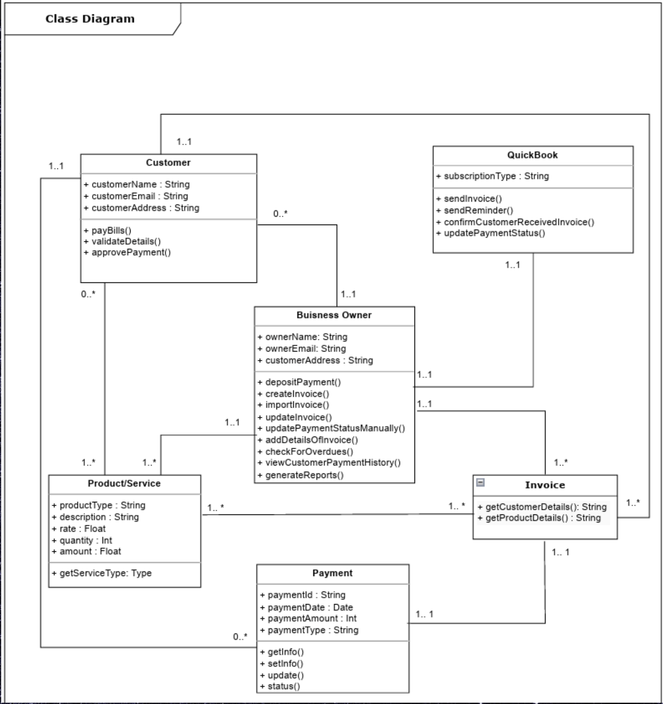

# Intuit Invoice System UML Overview
## Structural Diagrams
-  <b>Class Diagram</b>

A class diagram is a type of static structure diagram in the Unified Modeling Language (UML) that describes the structure of a system by showing the system's classes, their attributes, operations (or methods), and the relationships among the classes. It serves as a blueprint for the construction of the system's components and is fundamental to object-oriented modeling.
  

  The class diagram above is a structural representation of the objects within the Invoice Management System, detailing how they interact with each other within the system.

The diagram includes the following classes:

Customer: Holds details about the customer, such as name, email, and address, and has methods to pay bills, validate details, and approve payments.
Business Owner: Contains information about the business owner, including their name, email, and customer address. This class is responsible for payment deposits, invoice creation and importation, manual updates of invoice payment status, checks for overdue payments, viewing customer payment history, and report generation.
QuickBook: Represents the QuickBook system itself, with a subscription type attribute and methods for sending invoices and reminders, confirming invoice receipt with customers, and updating payment statuses.
Product/Service: Details the products or services with attributes such as type, description, rate, quantity, and amount. It includes a method to get the service type.
Payment: Manages payment information, including payment ID, date, amount, and type. It has methods to retrieve payment information, update, and get the status of the payment.
Invoice: Links to the Customer, Business Owner, and QuickBook classes, showing a many-to-one relationship from QuickBook to Invoice and a one-to-one relationship between Invoice and Business Owner. The Invoice class has methods for getting customer and product details.
The relationships between the classes are depicted using lines that represent the associations, with multiplicities specifying the nature of the relationship (e.g., one-to-one, one-to-many).

This diagram effectively captures the key entities of the system and their interactions, serving as a blueprint for the system's structure and the foundation for its development. It outlines the attributes and methods of each class, which encapsulate the system's functionality and data management. The class diagram is an essential component of the system documentation, providing a clear and concise overview for developers and stakeholders involved in the project.
## Behavioral Diagrams
  - Use Case Diagram
    
  This use case diagram represents the interactions between the users (Customer and Business Owner), and the Invoice Management System, as facilitated through an interface. The diagram captures the core functionalities provided by the system to enable effective and efficient management of invoices and related activities.
  
  

1. Business Owner: The business owner is responsible for the creation and management of invoices. They can perform several critical actions such as:
    - Create Invoice: Draft a new invoice to be sent to customers.
    - View Customer Payment History: Review past payments made by a customer to keep track of financial engagements.
    - Deposit Payments: Record the deposit of payments received from customers.
    - Generate Reports: Produce various reports for business analysis and record-keeping.
    - Manage Customer Account Details: Maintain and update customer account information.
    - Receive Bank Details: Obtain bank information for transaction purposes.

2. Customer: The customer is the recipient of the invoice who interacts with the system to complete payment or communicate discrepancies.
    - Validate Details: Confirm the accuracy of personal details before proceeding with payments.
    - Make Payment: Submit payment for an invoice received.
    - Decline Invoice: This new feature enables the customer to reject an invoice if the details appear incorrect, prompting a review or correction from the business owner.

3. System Interface: Represented as QB, the interface serves as the medium through which both actors interact with the system functionalities.
    - Send Invoice: The system sends the invoice to the customer and, as a new improvement, notifies the business owner of successful transmission.
    - Send Reminder Payment: Generates reminders for overdue payments, enhancing the payment collection process.
    - Update the Payment Status: Reflects the current status of the payment after customer actions.
    - Update Invoice: Allows for modifications and updates to be made to the invoice details.

Incorporating the listed improvements, the use case diagram now better reflects the comprehensive flow of actions and interactions within the Invoice Management System. The addition of an acknowledgment to the business owner regarding the successful delivery of the invoice ensures clarity in communication, while the option for the customer to decline the invoice adds a layer of verification and trust to the transaction process. These enhancements aim to streamline operations, reduce errors, and improve the overall satisfaction of both the business owner and the customers.
  - Activity Diagram
  - Sequence Diagram

