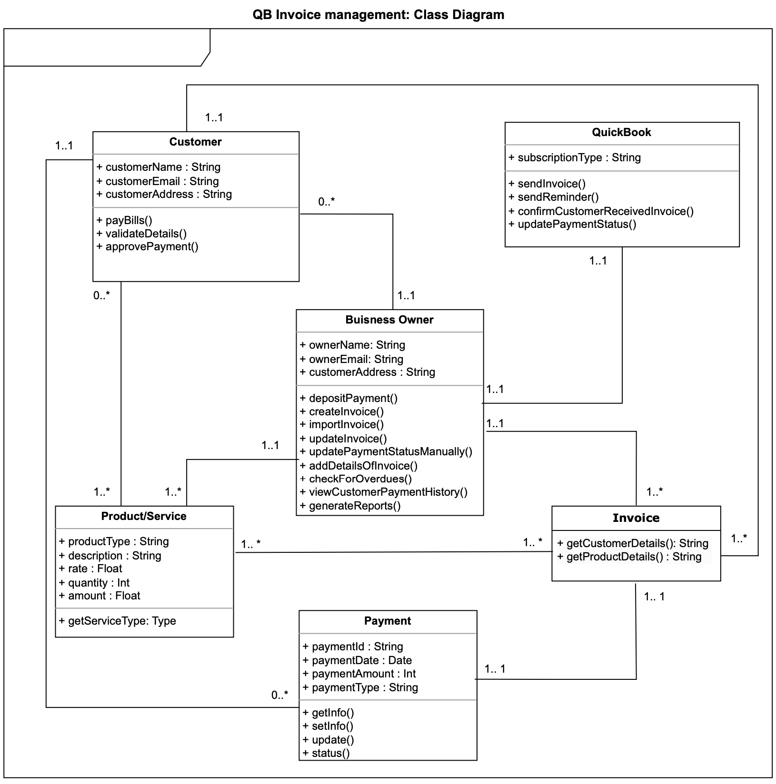
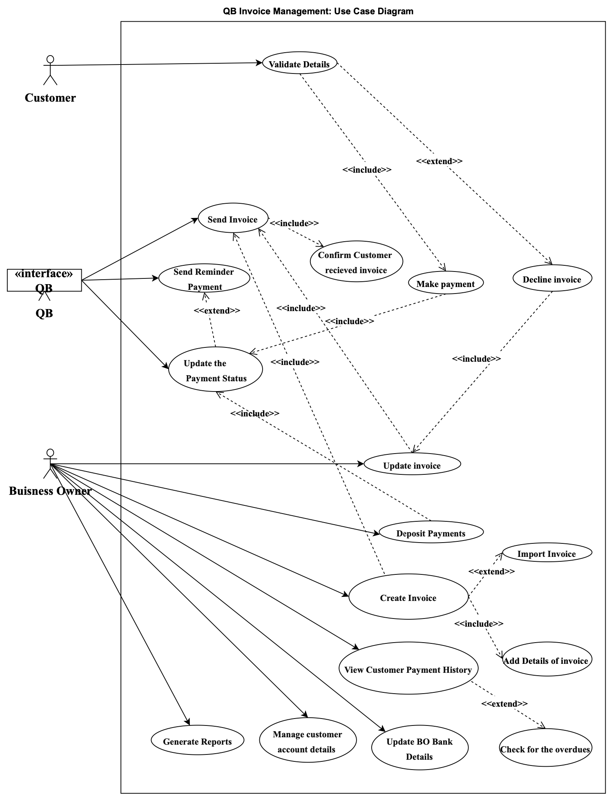
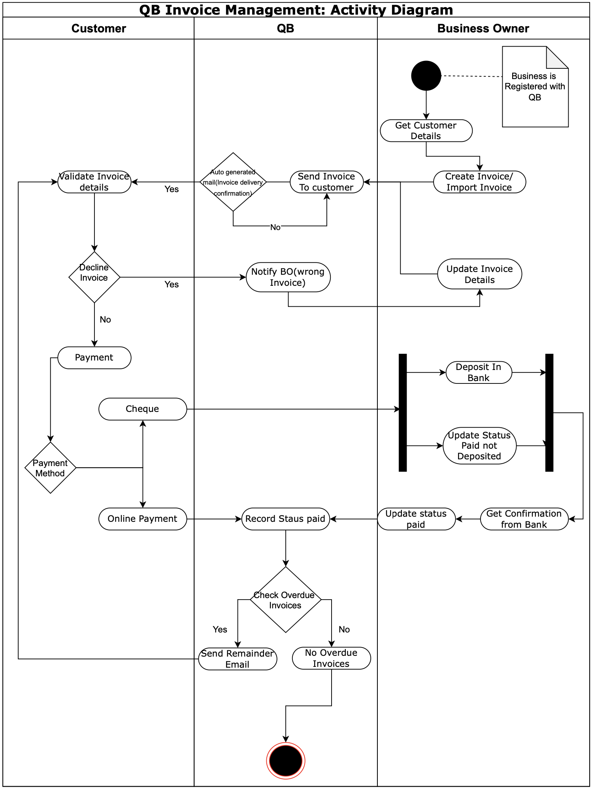
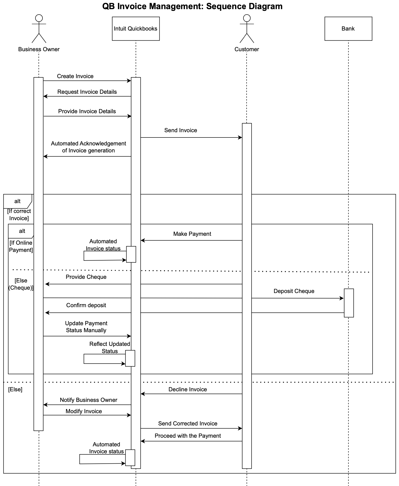

# Intuit Invoice System UML Overview
## Structural Diagrams
-  ### Class Diagram

A class diagram is a type of static structure diagram in the Unified Modeling Language (UML) that describes the structure of a system by showing the system's classes, their attributes, operations (or methods), and the relationships among the classes. It serves as a blueprint for the construction of the system's components and is fundamental to object-oriented modeling.

  

  The class diagram above is a structural representation of the objects within the Invoice Management System, detailing how they interact with each other within the system.

#### The diagram includes the following classes:

- <b>Customer</b>: Holds details about the customer, such as name, email, and address, and has methods to pay bills, validate details, and approve payments.
- <b>Business Owner</b>: Contains information about the business owner, including their name, email, and customer address. This class is responsible for payment deposits, invoice creation and importation, manual updates of invoice payment status, checks for overdue payments, viewing customer payment history, and report generation.
- <b>QuickBook</b>: Represents the QuickBook system itself, with a subscription type attribute and methods for sending invoices and reminders, confirming invoice receipt with customers, and updating payment statuses.
- <b>Product/Service</b>: Details the products or services with attributes such as type, description, rate, quantity, and amount. It includes a method to get the service type.
- <b>Payment</b>: Manages payment information, including payment ID, date, amount, and type. It has methods to retrieve payment information, update, and get the status of the payment.
- <b>Invoice</b>: Links to the Customer, Business Owner, and QuickBook classes, showing a many-to-one relationship from QuickBook to Invoice and a one-to-one relationship between Invoice and Business Owner. The Invoice class has methods for getting customer and product details.

The relationships between the classes are depicted using lines that represent the associations, with multiplicities specifying the nature of the relationship (e.g., one-to-one, one-to-many).

This diagram effectively captures the key entities of the system and their interactions, serving as a blueprint for the system's structure and the foundation for its development. It outlines the attributes and methods of each class, which encapsulate the system's functionality and data management. The class diagram is an essential component of the system documentation, providing a clear and concise overview for developers and stakeholders involved in the project.
## Behavioral Diagrams
  - ### Use Case Diagram
    
  This use case diagram represents the interactions between the users (Customer and Business Owner), and the Invoice Management System, as facilitated through an interface. The diagram captures the core functionalities provided by the system to enable effective and efficient management of invoices and related activities.

  

  
<b>Business Owner </b>: The business owner is responsible for the creation and management of invoices. They can perform several critical actions such as:
- Create Invoice: Draft a new invoice to be sent to customers.
- View Customer Payment History: Review past payments made by a customer to keep track of financial engagements.
- Deposit Payments: Record the deposit of payments received from customers.
- Generate Reports: Produce various reports for business analysis and record-keeping.
- Manage Customer Account Details: Maintain and update customer account information.
- Receive Bank Details: Obtain bank information for transaction purposes.

<b>Customer</b>: The customer is the recipient of the invoice who interacts with the system to complete payment or communicate discrepancies.
- Validate Details: Confirm the accuracy of personal details before proceeding with payments.
- Make Payment: Submit payment for an invoice received.
- Decline Invoice: This new feature enables the customer to reject an invoice if the details appear incorrect, prompting a review or correction from the business owner.

<b> System Interface </b>: Represented as QB, the interface serves as the medium through which both actors interact with the system functionalities.
- Send Invoice: The system sends the invoice to the customer and, as a new improvement, notifies the business owner of successful transmission.
- Send Reminder Payment: Generates reminders for overdue payments, enhancing the payment collection process.
- Update the Payment Status: Reflects the current status of the payment after customer actions.
- Update Invoice: Allows for modifications and updates to be made to the invoice details.

Incorporating the listed improvements, the use case diagram now better reflects the comprehensive flow of actions and interactions within the Invoice Management System. The addition of an acknowledgment to the business owner regarding the successful delivery of the invoice ensures clarity in communication, while the option for the customer to decline the invoice adds a layer of verification and trust to the transaction process. These enhancements aim to streamline operations, reduce errors, and improve the overall satisfaction of both the business owner and the customers.
  - ### Activity Diagram

The activity diagram outlines a comprehensive process for managing invoices and payments within a Quickbooks (QB) system, involving interactions between customers, the QB system, and the business owner. The diagram captures the sequence of actions.

  

#### Start of the Process:
1. <b>Get Customer Details</b>: The process begins with gathering necessary customer details, essential for generating an invoice.
Business Registration Check with QB: Verifies if the business is registered with QuickBooks, a prerequisite for further actions within the system.
2. <b>Invoice Processing</b>:Create or Import Invoice: Depending on the scenario, an invoice is either created within the system or imported from an external source.
Invoice Validation: Each invoice undergoes a validation process to ensure accuracy and completeness of details.
    - Decline Invoice: Invoices failing validation are declined, leading to two potential actions:
      - Notify Business Owner (BO): The business owner is informed about the invoice issue.
      - Update Invoice Details: Necessary corrections are made to the invoice based on the feedback.
#### Payment Processing:
1. <b>Payment Method Decision</b>: For invoices moving past validation, a decision on the payment method is made, distinguishing between cheque and online payments.
    - Cheque Payment:
      - Proceeds to bank deposit.
      - Status is updated to "Paid not Deposited".
      - Await bank confirmation before updating the status to "paid".
    - Online Payment:
      - Record status as paid.
#### Overdue Invoice Management:
1. <b>Check Overdue Invoices</b>: Regular checks are performed to identify overdue invoices.
    - Overdue Invoices Found: Trigger sending of reminder emails to prompt payment.
    - No Overdue Invoices: No action needed, indicating a healthy accounts receivable status.
#### Notable Actions:
- <b>Auto-Generated Mail (Invoice Delivery Confirmation)</b>
  - Automatically sent upon invoice creation or import to confirm delivery to the customer.

- <b>Send Invoice to Customer(Updated)</b>: 
  - After validation and any necessary corrections, the invoice is forwarded to the customer, marking a crucial step in the invoicing process.
#### End of the Process:
- The diagram concludes with the resolution of invoice payments, whether through direct updates after online payments or post-bank confirmation for cheques, alongside managing overdue invoices through reminders or acknowledgments of their absence.

The diagram effectively captures a series of logical steps from invoice creation to payment, including essential contingencies for invoice validation failures and overdue payments.
Clear decision points are highlighted, particularly regarding payment methods and overdue invoice management, facilitating understanding of different paths within the process.
Incorporating both automated and manual steps (e.g., auto-generated mails and bank deposits) provides a comprehensive view of the workflow, emphasizing the role of technology alongside traditional payment handling methods.
This structured description aims to encapsulate the detailed workflow captured in the activity diagram, offering insights into the end-to-end process of invoice management within a Quickbooks system, from creation to payment, including the proactive handling of overdue invoices.
- ### Sequence Diagram

The sequence diagram visualizes the interactions among the Business Owner, Customer, Intuit Quickbooks, and Bank, detailing the process flow for invoice generation and payment processing.

#### Participants:
- <b>Business Owner</b>: Initiates the process by creating an invoice.
- <b>Customer</b>: Receives the invoice and makes a payment.
-  <b>Intuit Quickbooks</b>: The platform through which the invoice is created and payment status is managed.
-  <b>Bank</b>: Where cheque deposits are made and confirmed.

#### Process Flow:
1. <b>Invoice Creation</b>:
   - The Business Owner requests invoice details, which are provided back to Quickbooks.
   - Quickbooks sends an automated acknowledgment of invoice generation back to the Business Owner.

2. <b>Invoice Sending</b>:
   - Quickbooks sends the invoice to the Customer.

3. <b>Payment Decision and Processing</b>:
   - The Customer makes a payment decision. If the payment is online, Quickbooks updates the invoice status automatically.
   - If the payment is through cheque, the Customer provides a cheque, and the Bank is involved in the process of depositing the cheque.
   - Quickbooks requests confirmation of the deposit from the Bank, and upon confirmation, the payment status is updated manually in Quickbooks.

4. <b>Invoice Correction</b>:
   - If there is an issue with the invoice, it is declined, and Quickbooks notifies the Business Owner.
   - The Business Owner modifies the invoice, and an automated status update occurs in Quickbooks.
   - A corrected invoice is then sent to the Customer, and the payment process proceeds.

#### Notable Elements:
- <b>Alternative Paths (alt)</b>: The diagram specifies alternative pathways for different scenarios (correct/incorrect invoice, online payment/cheque payment), indicating the conditional logic of the process.
- <b>Interaction</b>: Each participant's role is clearly delineated, showing back-and-forth communication and decision-making that moves the process forward.

#### Summary:
The sequence diagram systematically documents the series of steps from the creation of an invoice by the Business Owner to the payment processing and status update, including conditional handling of invoice corrections and payment methods. The use of Intuit Quickbooks as the intermediary system for processing and managing invoices and payments is central to the workflow, with the Bank serving as the external entity for processing cheque payments. The diagram effectively communicates a typical financial transaction workflow in a business context, emphasizing the importance of communication between systems and participants for smooth financial operations.

